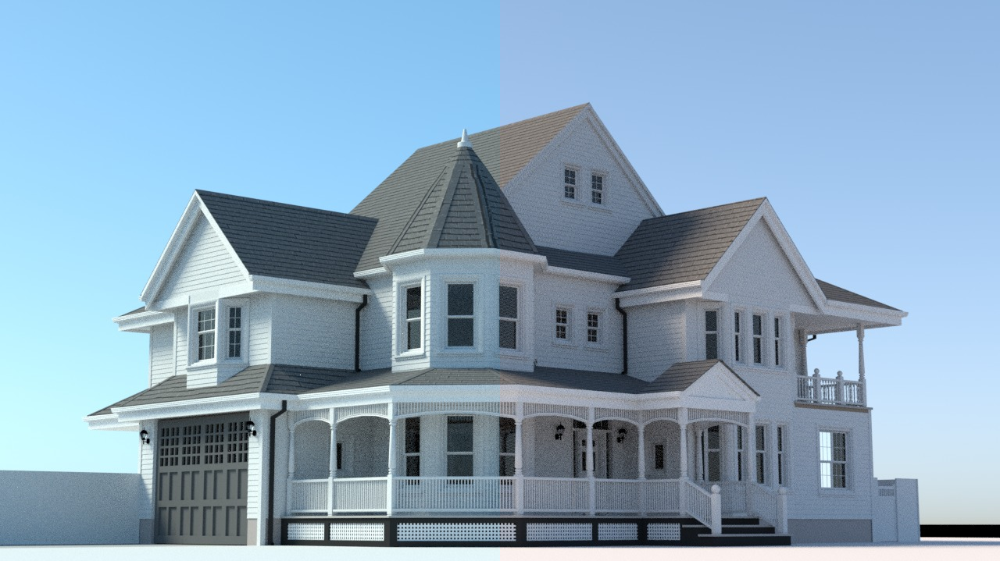
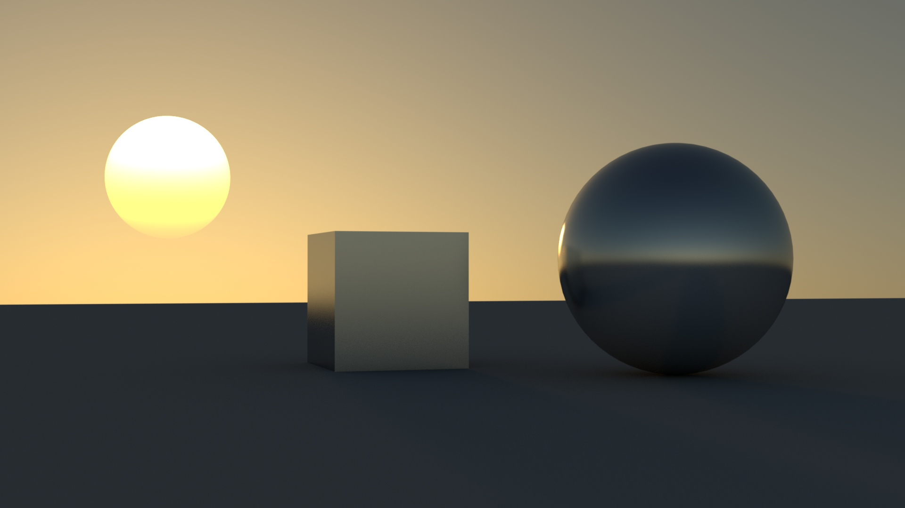

# Google Summer of Code 2020 Appleseed - Final Report
 
## Revisiting Physical Sun and Sky Model

During the summer my project was to improve the current Physical Sun and Sky model fixing the blue/green tint on the sky and add features, such as a visible solar disk, the ability to configure the sun and the sky model with geographic location and other improvements and features for the sun and sky.

## Code:

> [#2811](https://github.com/appleseedhq/appleseed/pull/2811) 
> [#2873](https://github.com/appleseedhq/appleseed/pull/2873)
> [#2870](https://github.com/appleseedhq/appleseed/pull/2870)
> [#2866](https://github.com/appleseedhq/appleseed/pull/2866)
> [#518](https://github.com/appleseedhq/blenderseed/pull/518)
> [#365](https://github.com/appleseedhq/appleseed-max/pull/365)
> [#265](https://github.com/appleseedhq/appleseed-maya/pull/235)

## Pre-GSoC work:

Before the beginning of GSoC, I start working on a PR [#2811](https://github.com/appleseedhq/appleseed/pull/2811) to fix the spectral illuminance to cieXYZ conversions. This fixed the blue/green tint in the sky:

I had to refactor most of the code after gsoc started in order to merge it into Appleseed.

A Full comparison among before/after appleseed and Corona/Arnold renderers:
https://mororo250.github.io/Gsoc-sun-sky/Appleseed_comparison/appleseed_compare.

## GSoC work:

### Appleseed Sun Disc:

Added a solar disc to the physical sky model.

I also implemented the solar radiance function presented by [Hosek-Wilkie](https://cgg.mff.cuni.cz/projects/SkylightModelling/).

##### Using Hosek Radiance Function:

### Ability to configure the sun and the sky model with geographic location:

Control of the sun Position based on options like Hours, minutes, seconds, Month, day, year, latitude and longitude, that allow the user to simulate a precise sun position.
 
Currently, this method of positioning the sun is available in all the plug-ins: Blender, 3dMax and Maya, but it’s not possible to use it inside Appleseed Studio.

### Other features and bug fixes:

During this summer I had to fix some bugs among them:

## Future work:

There are several ways to improve the current physical sky model in Appleseed. I have select some features and improvements that I am planning to implement in Appleseed in the next few months:

### 1. Precomputed sky and sun:

In the current implementation we compute the sun/sky radiance every time we sample it. The problem of this is that we compute the radiance coming from a  specific direction of the sky several times over. One way to speed up the current implementation of the sun and sky model is to precompute the sky into a texture.

### 2. Adapting the model to ExoPlanets Scenes:

I planned to implement this during this summer, unfortunately I didn’t have time to do it. Ability to bind multiple suns to the sky texture and ability to change the sun's blackbody radiation. https://cgg.mff.cuni.cz/projects/SkylightModelling/sccg_2013_alien_sun_preprint.pdf

### 3. Implement an improved Hosek implementation:

Some other renderers have implemented an improved version of the Hosek model, as Vray and Corona Renderer. There are several ways to improve the Hosek sky model. Some of them are:

Recompute all the input values using a more accurate non-analytical sky model, as libradtran for example.
Include after sunset conditions to the original model.

## Conclusion

I am very grateful to GSOC and Appleseed for the opportunity to work on a project for a renderer engine like Appleseed. I special thanks to François Beaune, for the many insights and advice, and the whole Appleseed's community who creates an amaizing and supportive atmosphere around Appleseed. 
