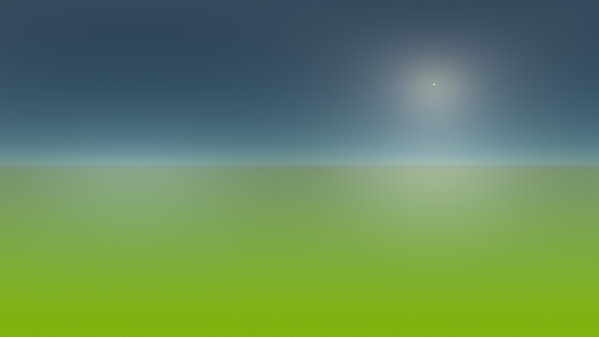
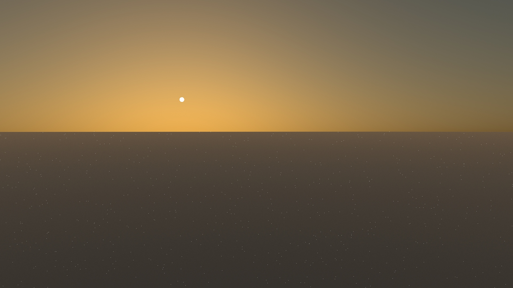
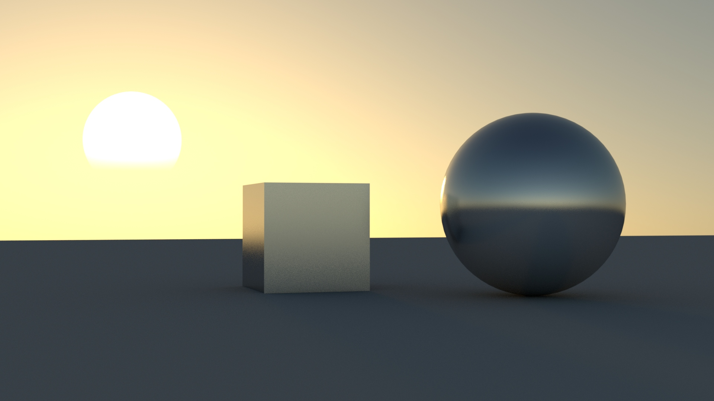
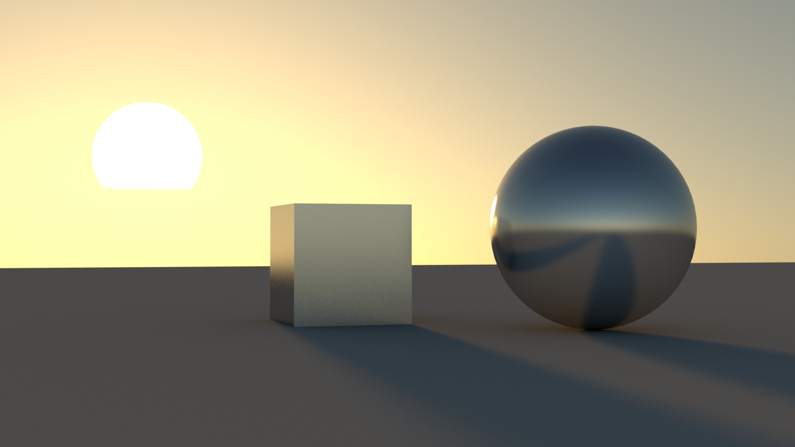

# Google Summer of Code 2020 Appleseed - Final Report
 
## Revisiting Physical Sun and Sky Model

During this summer my GSOC project was to improve the current Physical Sun and Sky model fixing the blue/green tint on the sky and add features, such as a visible solar disk, the ability to configure the sun and the sky model with geographic location and other improvements and for the sun and sky.

## Code:

* [#2811](https://github.com/appleseedhq/appleseed/pull/2811) 
* [#2873](https://github.com/appleseedhq/appleseed/pull/2873)
* [#2870](https://github.com/appleseedhq/appleseed/pull/2870)
* [#2866](https://github.com/appleseedhq/appleseed/pull/2866)
* [#518](https://github.com/appleseedhq/blenderseed/pull/518)
* [#365](https://github.com/appleseedhq/appleseed-max/pull/365)
* [#265](https://github.com/appleseedhq/appleseed-maya/pull/235)

## GSoC work:

### Fix green/blue tint:

Before the beginning of GSoC, I start working on the PR [#2811](https://github.com/appleseedhq/appleseed/pull/2811) to fix the spectral to cieXYZ conversions. Previously, Appleseed was using spectral reflectance to CIEXYZ method to convert emissive cases. This was given a blue/green tint every time that a spectral light was being used. Fixing the problem not only fixed the blue/green tint present on the sky models but improved the overall fidelity of Appleseed:

*Old version on the left and newer version on the right*

During the community bonding period, I had to refactor most of this PR.

A Full comparison among Appleseed before and after [#2811](https://github.com/appleseedhq/appleseed/pull/2811) and Corona renderer and Arnold.
https://mororo250.github.io/Gsoc-sun-sky/Appleseed_comparison/appleseed_compare.

### Appleseed Sun Disc:

Even though Appleseed's physical sky already had a solar radiance function implemented, it was missing a visible solar disc. Initially, I used the already implemented Preetham's radiance function to implement a visible solar disc with limb darkening. In my proposal, I included some extra optical phenomena for the sun, such as [red flash](https://www.sciencephoto.com/media/536661/view/red-flash-of-the-sun) and [mirrages](https://en.wikipedia.org/wiki/Mirage_of_astronomical_objects). Unfortunately, those phenomena are impossible to be implemented on an analytical sun/sky model, also mirages needs curved ray tracing[5](https://www.sciencedirect.com/science/article/abs/pii/S0097849304001967?via%3Dihub) which are not supported by Appleseed.

##### Using Preetham6 Radiance Function:

Later, I also implemented the solar radiance function presented by Hosek-Wilkie[2](https://cgg.mff.cuni.cz/projects/SkylightModelling/).

##### Using Hosek Radiance Function:

### Ability to configure the sun and the sky model with geographic location:

The goal here was to allow the users to control the sun Position based on options like Hours, minutes, seconds, month, day, year, latitude and longitude, that allow the user to simulate a precise sun position. To achieve this I used the algorithm presented by Jean Meeus in his book Astronomical Algorithms. This algorithm is also used by [the solar position calculator](https://www.esrl.noaa.gov/gmd/grad/solcalc/index.html) of the National Oceanic and Atmospheric Administration (NOAA).
 
Currently, this method of positioning the sun is available in all the plug-ins: Blender, 3dMax, and Maya, but it’s not possible to use it inside Appleseed Studio.

### Other features and some critical bugs:

#### Ground color and ground albedo:

Now the user can select any color as the ground albedo and the ground color is set based on ground albedo specified by the user.

#### Fireflies:

Backing the sun disc into the sky causes several fireflies to appear:

The artifacts happen due to the fact that after backing the sun into the sky. It becomes one of the most difficult to sample types of environment maps, those with the majority of their illumination concentrated in a set of small bright areas. Usually, to solve this problem it's used some kind of probability distribution function(pdf) based on the [environment map’s luminance distribution](http://web.cs.wpi.edu/~emmanuel/courses/cs563/S07/projects/envsample.pdf). This would be the optimal solution for this problem, but it's necessary to precompute the sky into a texture for it to be possible. As a temporary solution for this, I changed the pdf function, so that when a ray hit the sun it's pdf is bigger than the sky's pdf by a factor of (sun radiance / sky radiance). 

#### Sun's radiance weaker than expected:

When comparing the results of Appleseed with other renderers, I noticed that Appleseed's sun radiance was 3 to 4 times weaker than the results from other renderers, even though the sky radiance was the same.

The problem was related to how Appleseed was calculating the sky radiance.

## Future work:

There are several ways to improve the current physical sky model in Appleseed. I have selected some features and improvements which I am planning to implement in Appleseed in the next few months:

### 1. Precomputed sky and sun:

In the current implementation, we compute the sun/sky radiance every time we either sample or evaluate it. The problem of this is that we compute the radiance coming from a specific direction of the sky several times over. One way to speed up the current implementation of the sun and sky model is to precompute the sky into a texture. This also provides a better solution for the fireflies.

### 2. Adapting the model to ExoPlanets Scenes:

The ability to bind multiple suns to the sky texture and ability to change the sun's blackbody radiation.[6](https://cgg.mff.cuni.cz/projects/SkylightModelling/sccg_2013_alien_sun_preprint.pdf)
I initially planned to implement this during this summer. Unfortunately, I didn’t have time to do it.

### 3. Implement an improved Hosek implementation:

There are several ways to improve the Hosek sky model. Some of them are:

* Recompute all the input values using a more accurate non-analytical sky model, as libradtran for example.
* Include after sunset conditions to the original model.
* Add aerial perspective.

Some other renderers have implemented an improved version of the Hosek model, as Vray and Corona Renderer, providing much more pleasant and accurate results.

### 4. Improvement in the user interface for the solar position calculator

Currently, the user needs to manually set latitude, longitude, and time zone. This is not very intuitive and could be improved by allowing the user to set those variables by either selecting it on a map or searching for a specific city by name.

## Conclusion

I am very grateful to GSOC and Appleseed for the opportunity to work on a project for a renderer engine like Appleseed. I learned far more than I thought I would from color science to how to properly sample an environmental map. I special thanks to François Beaune, for the many insights and advice, and the whole Appleseed's community who creates an amazing and supportive atmosphere around Appleseed.

## References

[1] PREETHAM A. J., SHIRLEY P., SMITS B.: A practical ana-ytic model for daylight. In Proceedings of the 26th annual conference on Computer graphics and interactive techniques(1999), ACM Press/Addison-Wesley Publishing

[2] HOSEK L., WILKIE A.: An analytic model for full spectral sky-dome radiance. ACM Transactions on Graphics (TOG) 31, 4 (2012), 95((https://cgg.mff.cuni.cz/projects/SkylightModelling))

[3] Hosek, Lukas, and Alexander Wilkie. “Adding a Solar-Radiance Function to the Hošek-Wilkie Skylight Model.” IEEE Computer Graphics and Applications 33 (2013): 44-52.

[4] Lintu, Andrei et al. “Realistic Solar Disc Rendering.” WSCG (2005).

[5] Serón, Francisco J. et al. “Implementation of a method of curved ray tracing for inhomogeneous atmospheres.” Comput. Graph. 29 (2005): 95-108.(https://www.sciencedirect.com/science/article/abs/pii/S0097849304001967?via%3Dihub)

[6] Wilkie, Alexander & Hošek, Lukas. (2013). Predicting Sky Dome Appearance on Earth-like Extrasolar Worlds. Proceedings - SCCG 2013: 29th Spring Conference on Computer Graphics.(https://cgg.mff.cuni.cz/projects/SkylightModelling/sccg_2013_alien_sun_preprint.pdf)
